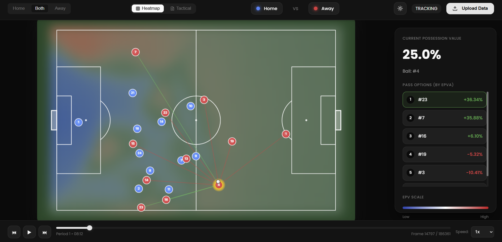
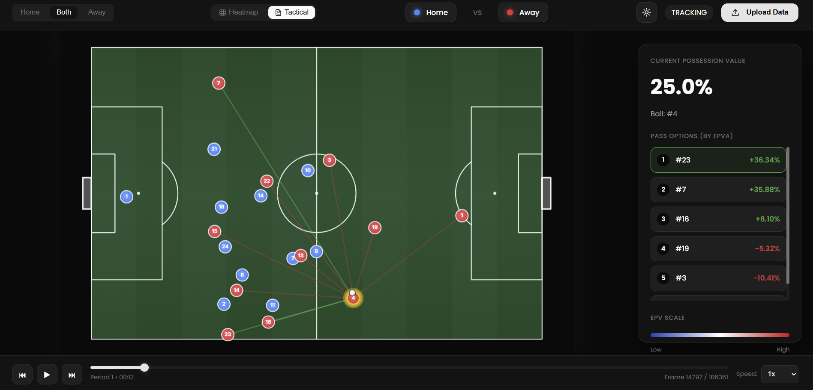

# FIFA EPV Analyzer

A sophisticated football analytics dashboard for calculating and visualizing **Expected Possession Value (EPV)** and **Pitch Control**. This tool implements the methodology described in the research paper *"Decomposing the Immeasurable: The Flow of Expected Possession Value"* by Fernández, Bornn, and Cervone (2019).

## Overview

FIFA EPV Analyzer is an advanced sports analytics application that provides real-time tactical analysis of football matches. By processing tracking data and event information, the system evaluates possession value, team control over the pitch, and optimal decision-making for players in possession of the ball.

This project was tested using data from the **FIFA World Cup 2022**.

## Visual Demonstrations

### EPV Heatmap Visualization
The application generates dynamic heatmaps showing the expected possession value across different areas of the pitch, helping analysts understand the value of ball positioning in real-time.



### Tactical Analysis View
View detailed tactical information including defensive lines, zones, pitch control, and pass evaluation metrics.



## Features

### Core Analytics

**Expected Possession Value (EPV)**
- Real-time calculation of possession value based on player positioning and ball location
- Dynamic EPV surface generation across the entire pitch
- Frame-by-frame analysis of possession value changes

**Pitch Control Analysis**
- Physics-based time-to-intercept model
- Determines team influence over different areas of the pitch
- Visualizes territorial control through heatmaps

**Action Probability Engine**
- Pass probability and expected value calculations
- Ball drive evaluation and risk assessment
- Shot probability based on position and defensive pressure

**Tactical Intelligence**
- Automatic defensive line detection
- Zone classification (Z1-Z4) for tactical context
- Real-time identification of pressing intensity

**Pass Evaluation System**
- Ranks all potential pass options by EPV added
- Success probability for each passing lane

**Interactive Visualization**
- Real-time pitch representation with player positions
- Overlay heatmaps for EPV and pitch control
- Frame navigation and playback controls
- Dark/light mode support

## Prerequisites

Before you begin, ensure you have the following installed:
- [Node.js](https://nodejs.org/) (v18.0.0 or higher recommended)
- [npm](https://www.npmjs.com/) (comes with Node.js)

## Installation

1. **Clone the Repository**
   ```bash
   git clone https://github.com/fady-nasser/FIFA-EPV-Analyzer.git
   cd FIFA-EPV-Analyzer
   ```

2. **Install Dependencies**
   ```bash
   npm install
   ```

## Usage

### Starting the Application

To start the development server and view the dashboard in your browser:

```bash
npm run dev
```

Once the server is running, the application will be accessible at `http://localhost:5173`.

### Data Requirements

The application expects tracking data and event data in specific formats:
- **Tracking Data**: Player positions (x, y coordinates) at each frame with team identification
- **Event Data**: Match events including passes, shots, and other actions with timestamps
- Data should be placed in the appropriate directory for the data loader to process

### Controls

- **Frame Navigation**: Use the slider or arrow buttons to navigate through frames
- **Visualization Toggle**: Switch between EPV heatmap and pitch control views
- **Dark Mode**: Toggle between light and dark themes
- **Pass Evaluation**: Click on players to see potential pass options and their EPV impact

## Demo Tutorial

For a comprehensive guide on how to use the application, watch our [demo tutorial video](https://drive.google.com/drive/folders/12CoJQfMZZFGwyfVHSP6VTMamR1Nl7nwL).

## Project Structure

```
FIFA-EPV-Analyzer/
├── src/
│   ├── components/          # React UI components
│   │   ├── Pitch.jsx       # Main pitch visualization component
│   │   ├── EPVPanel.jsx    # EPV metrics display panel
│   │   ├── Controls.jsx    # Playback and visualization controls
│   │   └── Header.jsx      # Application header with theme toggle
│   ├── utils/              # Core analytical models
│   │   ├── epvCalculator.js      # Main entry point for frame analysis
│   │   ├── epvModel.js           # Stock EPV calculations and surface generation
│   │   ├── pitchControl.js       # Physics-based pitch control model
│   │   ├── passEvaluator.js      # Pass risk and reward evaluation
│   │   ├── ballDriveModel.js     # Ball carrier movement evaluation
│   │   ├── defensiveLines.js     # Tactical zone and line detection
│   │   └── dataLoader.js         # Tracking and event data parsing
│   ├── App.jsx             # Main application component
│   ├── index.css           # Global styles and theme variables
│   └── main.jsx            # Application entry point
├── assets/                 # Application assets and screenshots
├── index.html              # HTML template
├── package.json            # Project dependencies and scripts
└── vite.config.js          # Vite configuration
```

## Technical Background

### EPV Decomposition Model

The analyzer implements a three-component EPV framework:

1. **Selection Probability (P_select)**
   - Likelihood of a player choosing a specific action (pass, drive, shot)
   - Based on player position, defensive pressure, and tactical context

2. **Outcome Probability (P_success)**
   - Probability that the chosen action will be successful
   - Incorporates pitch control, passing lanes, and defensive positioning

3. **Expected Value (EPV_result)**
   - The EPV of the resulting state after the action
   - Calculated using the EPV surface model

The total EPV for an action is calculated as:
```
EPV_action = P_select × P_success × EPV_result
```

### Pitch Control Model

The pitch control implementation uses a time-to-intercept approach:
- Players have maximum velocities and reaction times
- Ball movement speed is modeled based on action type
- Control is calculated using a sigmoid function based on arrival time differentials
- The model accounts for player momentum and spatial positioning

### Defensive Analysis

Defensive lines and zones are detected using:
- K-means clustering for line identification
- Y-coordinate analysis for vertical organization
- Zone classification based on pitch division (Z1: defensive third, Z2: midfield, etc.)

## Performance Considerations

- Frame calculations are optimized for real-time analysis
- EPV surface generation uses efficient grid sampling
- Pitch control calculations leverage spatial indexing
- React components use memoization to prevent unnecessary re-renders

## Contributing

Contributions are welcome! Please ensure that any pull requests:
- Follow the existing code style and structure
- Include appropriate documentation
- Add tests for new features when applicable

## Acknowledgments

This project was developed under the supervision of **Dr. Tamer Basha**.

This project implements research from:
- Fernández, J., Bornn, L., & Cervone, D. (2019). "Decomposing the Immeasurable: The Flow of Expected Possession Value"

## Contributors

- **Seif Amr**
- **Marvin Ehab**
- **Fady Nasser**
- **Mahmoud Zahran**
- **Bassel Mostafa**

## License

This project is for educational purposes related to sports analytics.

## Contact

For questions or feedback, please open an issue on the GitHub repository.
